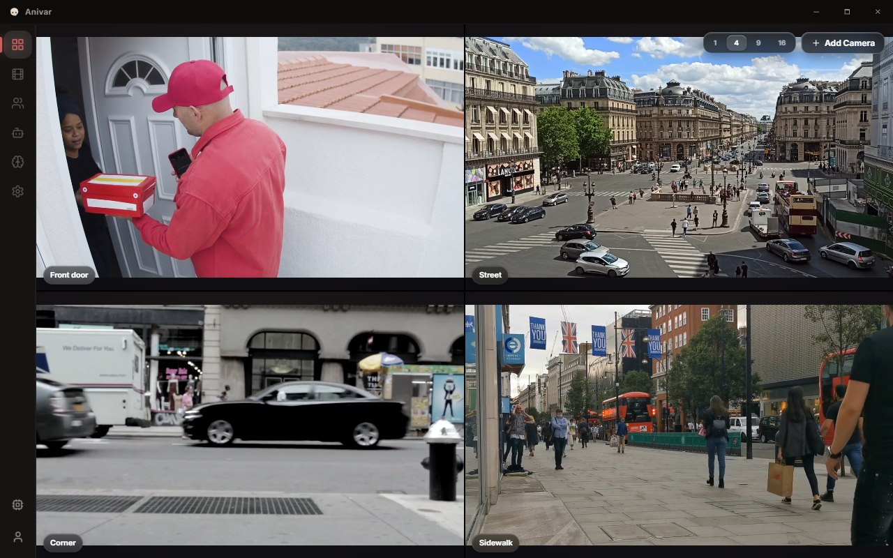
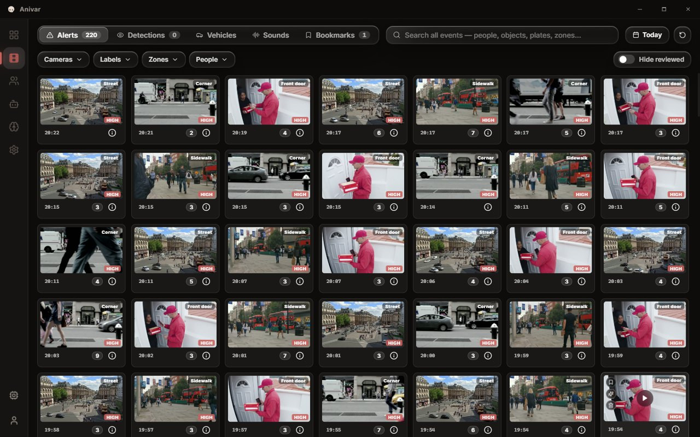
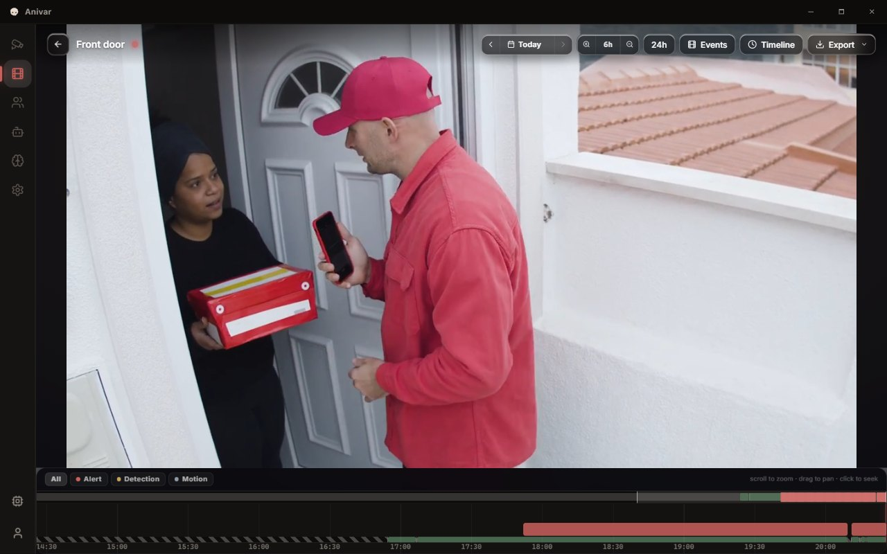
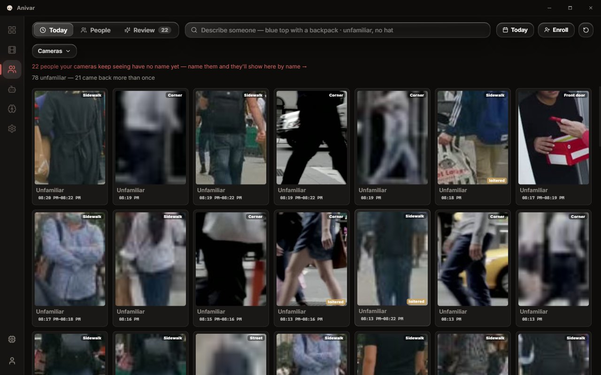
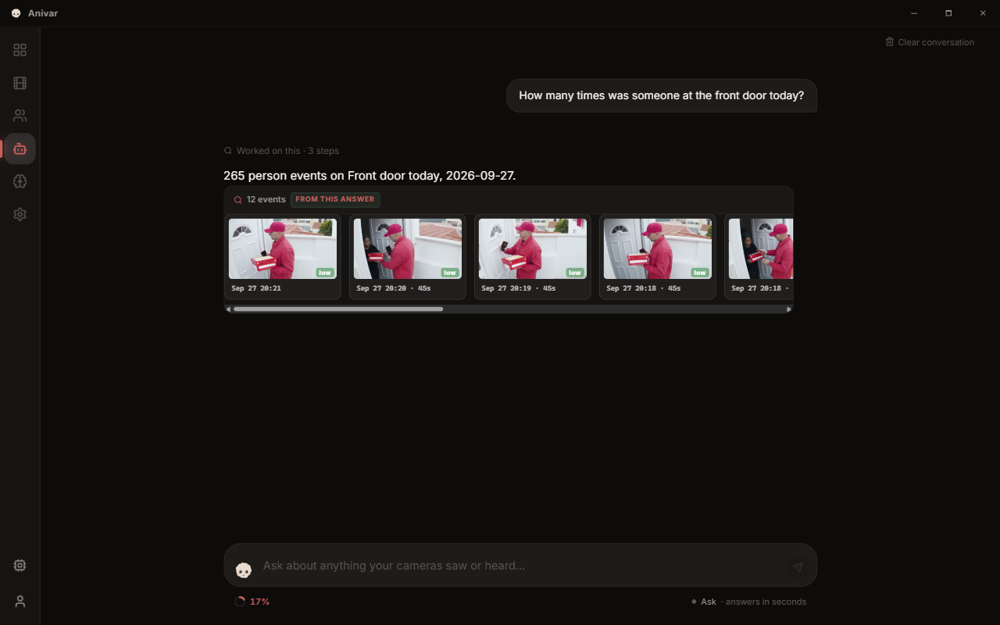

<p align="center">
  
</p>

<p align="center">
  <a href="https://github.com/anivarhq/anivar/releases/latest"></a>
  <a href="https://github.com/anivarhq/anivar/releases"></a>
  <a href="LICENSE"></a>
  <a href="https://github.com/anivarhq/anivar/actions/workflows/ci.yml"></a>
</p>

<p align="center">
  <a href="#download"><b>Download</b></a> ·
  <a href="https://anivarhq.github.io/anivar-site/"><b>Website</b></a> ·
  <a href="#what-it-does"><b>What it does</b></a> ·
  <a href="#how-it-compares"><b>How it compares</b></a> ·
  <a href="CONTRIBUTING.md"><b>Build from source</b></a>
</p>

Anivar turns your own Windows, Mac or Linux computer into a security-camera recorder with AI
built in. Add your cameras and it records around the clock, spots people, cars and sounds, and
learns the faces you name. Ask it *"what happened last night?"* and it answers with the clips.
The video and the AI stay on your computer, and there is no subscription.

<p align="center">
  
</p>

## Download

Free. These links always fetch the newest version.

| Platform | Download | Notes |
|---|---|---|
| **Windows** 10 / 11, x64 | [**Installer** `.exe`](https://github.com/anivarhq/anivar/releases/latest/download/Anivar-windows-x64-setup.exe) | Installs for your user — no administrator prompt |
| **macOS** 11+, **Apple Silicon** | [**Disk image** `.dmg`](https://github.com/anivarhq/anivar/releases/latest/download/Anivar-macos-arm64.dmg) | Intel Macs are not supported |
| **Linux** x86_64 | [**AppImage**](https://github.com/anivarhq/anivar/releases/latest/download/Anivar-linux-x86_64.AppImage) · [`.deb`](https://github.com/anivarhq/anivar/releases/latest/download/Anivar-linux-amd64.deb) · [`.rpm`](https://github.com/anivarhq/anivar/releases/latest/download/Anivar-linux-x86_64.rpm) | Ubuntu 22.04 / Debian 12 or newer |

### Before you install

**Anivar is alpha, and not yet code-signed.** The first time you open it, Windows says
*"Windows protected your PC"*: click **More info → Run anyway**. On a Mac, try to open it once,
then go to **System Settings → Privacy & Security → Open Anyway**. It doesn't update itself yet —
**Settings → Check for Updates** tells you when a new version is out ([what changed](CHANGELOG.md)).

## Private by design, and you can check

- **No account, no cloud, no telemetry.** There is no Anivar server between you and your
  cameras. Nothing is sent anywhere until you turn on a feature that sends it — a cloud AI
  provider, Telegram alerts, remote access, or a share link — and [PRIVACY.md](PRIVACY.md)
  lists exactly what each one sends.
- **The AI runs on your computer.** Detection, face recognition, search and the assistant's
  language model all run inside the app. After a one-time model download, none of them needs
  the internet.
- **All of it is open.** Every line is in this repository under Apache-2.0, and every
  download has a published checksum ([verify yours](#verify-your-download)).

## What it does

- **Records every camera, all day.** USB webcams and RTSP / ONVIF IP cameras, with audio.
  IP cameras play live in under a second over WebRTC, recordings play back on a timeline you
  can scrub, and a disk budget with retention keeps storage in check.
- **Knows what it saw.** People, vehicles, licence plates, and sounds like breaking glass or an
  alarm. It recognises the faces you've named, and alerts only on a pattern, not a single noisy
  frame.
- **Finds anything in plain words.** Search *"person with a package"* or *"red car"* across
  weeks of footage.
- **Answers questions with evidence.** Ask *"who came to the door today?"* and get the clips,
  snapshots and people behind the answer. The facts come from the database; the model only
  words them.
- **Tells you when it matters.** Telegram alerts with the clip attached, quiet hours, and
  per-category mute.
- **Lets you look from anywhere.** Remote viewing and expiring share links through your own
  [Tailscale](https://tailscale.com/) Funnel, behind an optional login.
- **Can keep identities out of the footage.** On USB cameras, privacy mode records a depth map
  instead of a picture, camera by camera.

<table>
  <tr>
    <td width="50%"><br><b>Review.</b> The whole day at a glance, and searchable.</td>
    <td width="50%"><br><b>Recordings.</b> Scrub any hour, jump straight to what happened.</td>
  </tr>
  <tr>
    <td width="50%"><br><b>People.</b> Name someone once and they're recognised from then on.</td>
    <td width="50%"><br><b>Assistant.</b> Answers from the database, with the clips behind them.</td>
  </tr>
</table>

How each part works, in detail: [docs/FEATURES.md](docs/FEATURES.md).

### Will it run on my computer?

- **Any recent PC or Apple Silicon Mac.** A GPU helps but is optional: Windows uses any
  DirectX 12 GPU, NVIDIA cards can add CUDA and TensorRT from a download inside the app, Macs
  use CoreML, and Linux runs detection on the CPU.
- **Memory:** plan on 2–3 GB for the app itself (2.25 GB measured on a working install).
- **Disk:** recording 24/7 at 2 Mbps takes about 21 GB per camera per day. Choose how many days
  to keep and it prunes the rest.

## How it compares

Checked September 2026; list prices in USD.

| | **Anivar** | [Frigate](https://github.com/blakeblackshear/frigate) | [Blue Iris](https://blueirissoftware.com/) | [Ring](https://ring.com/plans) / [Google Home](https://store.google.com/us/product/google_home_premium) plans |
|---|---|---|---|---|
| **Runs on** | A desktop app for Windows, macOS, Linux | A Linux server or Docker | Windows | Their cloud |
| **Your video lives** | On your computer | On your server | On your PC | On their servers |
| **Price** | Free (Apache-2.0) | Free (MIT) | $39.95 or $99.95, once | About $20 a month for the AI tier |
| **Setup** | Installer, then add cameras in the app | Docker and a YAML config | Installer | Phone app |
| **Maturity** | Alpha | Mature, large community | Mature | Mature |

If you already run a home server and want the most proven open-source option, Frigate is
excellent. Anivar is for people who want the same privacy without running a server.

**No spare camera?** [Chameleon IP](https://github.com/anivarhq/chameleon-ip), a sister project
in early development, turns an old phone or computer into an RTSP / ONVIF camera that Anivar —
or any other recorder — can add.

## Verify your download

Every download has a checksum beside it — add `.sha256` to the link. Save both in the same
folder, then:

```powershell
# Windows — prints True if the file is exactly the one we published
$want = (Get-Content .\Anivar-windows-x64-setup.exe.sha256).Split()[0]
(Get-FileHash .\Anivar-windows-x64-setup.exe -Algorithm SHA256).Hash -eq $want
```

```bash
shasum -a 256 -c Anivar-macos-arm64.dmg.sha256       # macOS
sha256sum -c Anivar-linux-x86_64.AppImage.sha256     # Linux (or the .deb / .rpm)
```

## Faces are biometric data

Face recognition stores special-category personal data under GDPR and similar laws.
[PRIVACY.md](PRIVACY.md) covers what is stored, what you take on when your cameras see people
beyond your household, and how to erase a person completely (**People → the person → Remove →
confirm erase**).

Found a vulnerability? Report it privately through
[GitHub's advisory form](https://github.com/anivarhq/anivar/security/advisories/new) — see
[SECURITY.md](SECURITY.md).

## Contributing

Pull requests are welcome. [CONTRIBUTING.md](CONTRIBUTING.md) covers building from source, the
native toolchain and the misleading errors it gives when something is missing, tests, and code
style; [docs/ARCHITECTURE.md](docs/ARCHITECTURE.md) maps the code.

## License

**Apache-2.0**, with a patent grant — see [LICENSE](LICENSE) and [NOTICE](NOTICE). Use it, fork
it, build a product on it.

Everything bundled in the installer is MIT or Apache-2.0. Model weights, `ffmpeg` and `go2rtc`
are not shipped: the app downloads them from their upstream projects onto your machine, so
their licences stay between you and their authors ([THIRD-PARTY-NOTICES.md](THIRD-PARTY-NOTICES.md)). No model is
preinstalled; **Arsenal** shows each one's licence before you install it. The object detectors
are Ultralytics YOLO26, **AGPL-3.0**, which needs a commercial licence from Ultralytics for
proprietary use. The on-device language models are under Liquid AI's LFM Open License.
